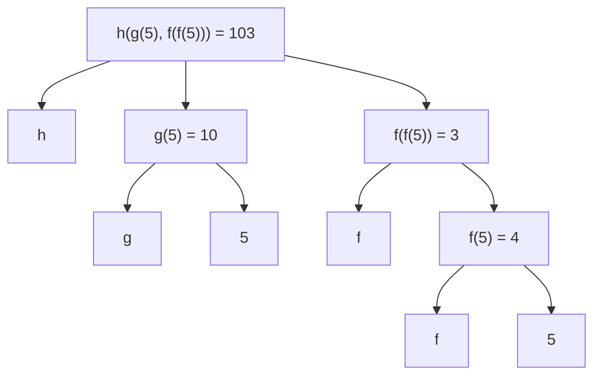

# Disc 00: Getting Started


## Part 2: Solve a problem together

```
Imagine you can call only the following three functions:
- f(x): Subtracts one from an integer x
- g(x): Doubles an integer x
- h(x, y): Concatenates the digits of two different positive integers x and y. For example, h(789, 12) = 78912

Definition: A small expression is a call expression that contains only f, g, h, the number 5, and parentheses. All of these can be repeated. For example h(g(5), f(f(5))) is a small expression that evaluates to 103.

What's the shortest small expresion you can find that evaluates to 2024?
```


h(g(5), f(f(5))) = 103


h(g(5), g(g(f(f(5))))) = 2024
