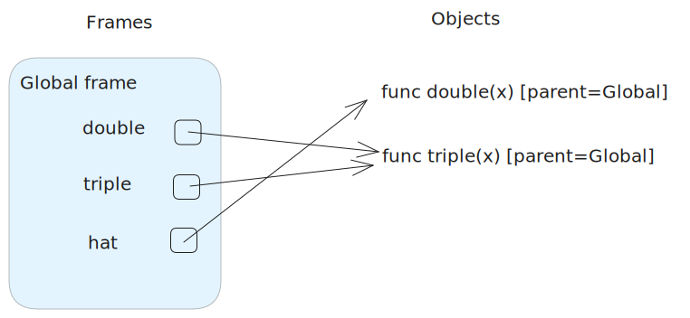

# Discussion 1: Control, Environment Diagrams

## Q1: Race

[race.py](./race.py)

## Q2: Fizzbuzz

[fizzbuzz.py](./fizzbuzz.py)

## Q3: Is Prime?

[is_prime.py](./is_prime.py)

## Q4: Unique Digits

[unique_digits.py](./unique_digits.py)

## Q5: Bottles

1) What determines how many different frames appear in an environment diagram?
    d) The number of times user-defined functions are called when running the code

2) What happens to the return value of `pass_it(bottles)`?
    d) None of the above

3) What effect does the line bottles = 98 have on the global frame?
    c) It has no effect on the global frame.

## Q6: Double Trouble

