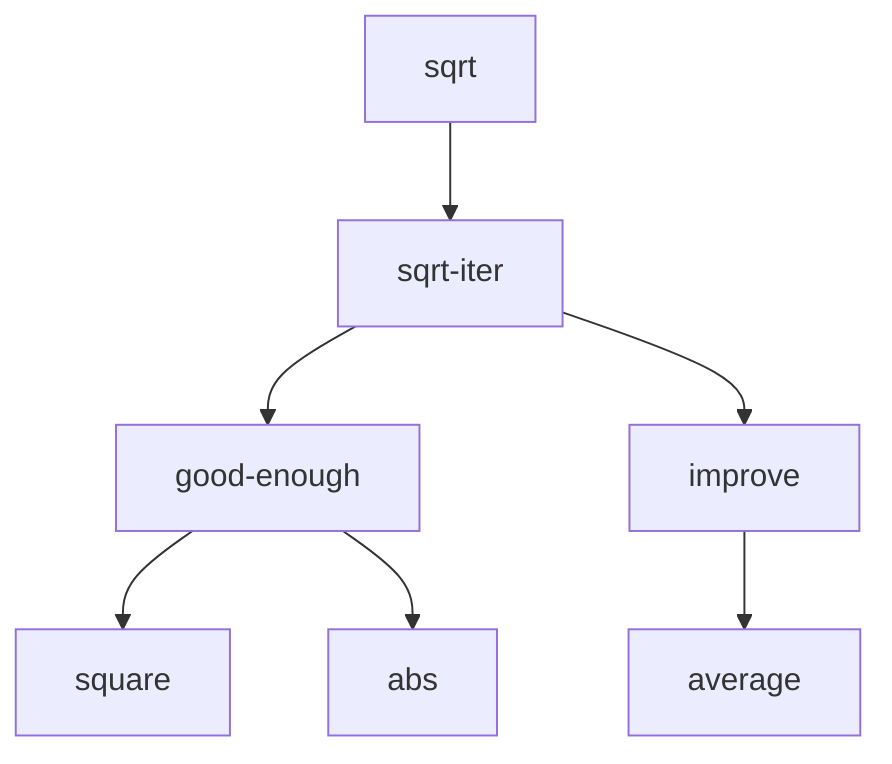

# 1 Building Abstractions with Procedures

## 1.1 The Elements of Programming
### 1.1.5 The Substitution Model for Procedure Application

Applicative order versus normal order

This alternative ``fully expand and then reduce'' evaluation method is known as *normal-order evalutation*, in contrast to the ``evaluate the arguments and then apply'' method that the interpreter actually uses, which is called *applicative-order evaluation*.

### 1.1.7 Example: Square Roots by Newton's Method

The contrast between mathematical function and computer procedures is a reflection of the general distinction between describing properties of things and describing how to do things, or, as it is sometimes referred to, the distinction between declarative knowledge and imperative knowledge. In mathematics we are usually concerned with declarative (what is) descriptions, whereas in computer science we are usually concerned with imperative (how to) descriptions.

In a related vein, an important current area in programming-language design is the exploration of so-called very high-level languages, in which one actually programs in terms of declarative statements. The idea is to make interpreters sophisticated enough so that, given ``what is" knowledge specified by the programmer, they can generate ``how to" knowledge automatically.

### 1.1.8 Procedures as Black-Box Abstractions

The problem of computing square roots breaks up into a number of subproblems.

Procedural decomposition of the problem into subproblems.



It is crucial that each procedure accomplishes an identifiable task that can be used as a module in defining other procedures.

Regard procedure as a black box. procedural abstraction. So a procedure definition should be able to suppress detail. The users of the procedure may not have written the procedure themselves, but may have obtained it from another programmer as a black box. A user should not need to know how the procedure is implemented in order to use it.


#### Local names

The parameter names of a procedure must be local to the body of the procedure.

The set of expressions for which a binding defines a name is called the scope of that name.


#### Internal definitions and block structure

```
(define (sqrt x)
  (define (good-enough? guess)
    (< (abs (- (square guess) x)) 0.001))
  (define (improve guess)
    (average guess (/ x guess)))
  (define (sqrt-iter guess)
    (if (good-enough? guess)
        guess
        (sqrt-iter (improve guess))))
  (sqrt-iter 1.0))
```

Such nesting of definition, called block structure, is basically the right solution to the simplest name-packaging problem.

Then x gets its value form the argument with which the enclosing procedure sqrt is called. This discipline is called lexical scoping.

We will use block structure extensively to help us break up large programs into tractable pieces. The idea of block structure originated with the programming language Algol 60. It appears in most advanced programming languages and is an important tool for helping to organize the construction fo large programs.


## 1.2 Procedures and the Processes They Generate


### 1.2.1 Linear Recursion and Iteration

linear recursive process, linear iterative process

a recursive process vs. a recursive procedure.

tail-recursive
